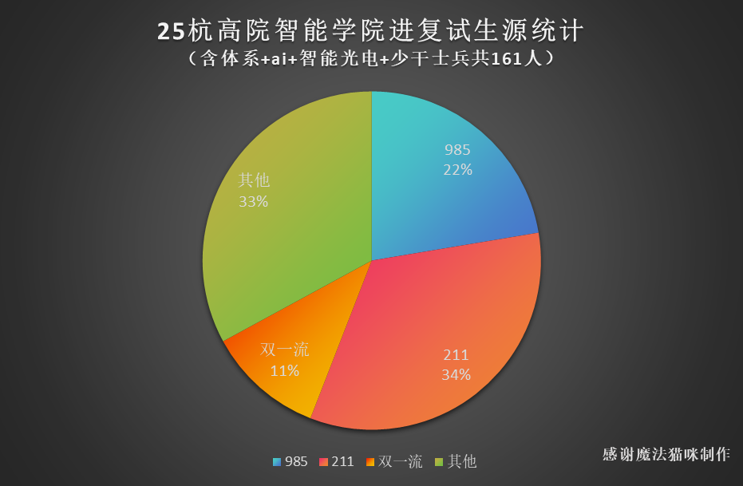
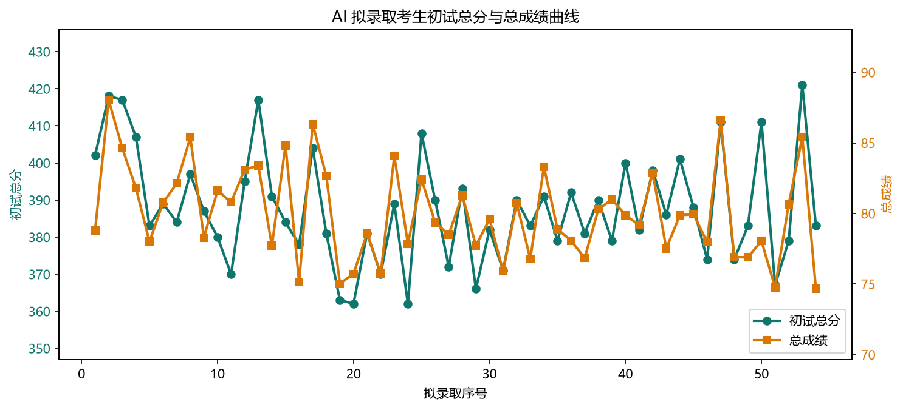
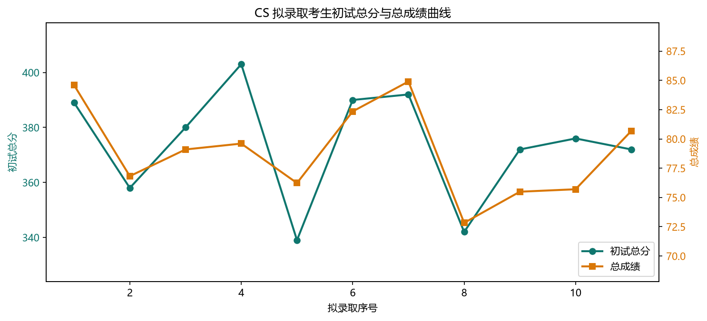
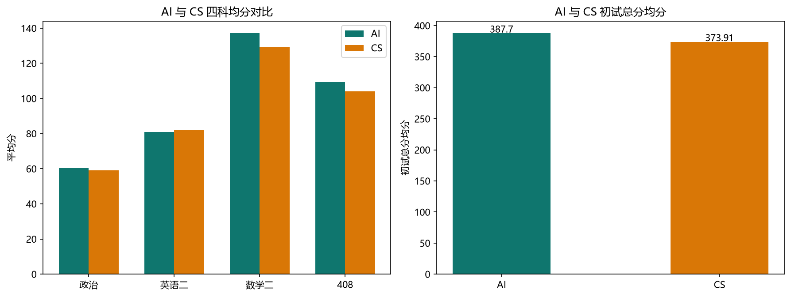

# 26 年复试录取情况

> 数据依据《HIAS_26_AI复试统计》《HIAS_26_CS复试统计》整理，仅保留拟录取考生，以官方公示为准。

## 数据曲线

## AI 专业复试统计

- 复试人数：73
- 拟录取：54

- 复录比：1.35
- 初试均分：60.00 · 79.89 · 136.03 · 108.14 · 384.05
- 复试均分：60.30 · 80.96 · 137.13 · 109.31 · 387.70

| 阶段 | 政治 | 英语二 | 数学二 | 408 | 总分 |
| --- | --- | --- | --- | --- | --- |
| 初试均分 | 60.00 | 79.89 | 136.03 | 108.14 | 384.05 |
| 复试均分 | 60.30 | 80.96 | 137.13 | 109.31 | 387.70 |

## AI 拟录取名单

| 政治 | 英语二 | 数学二 | 408 | 总分 | 复试成绩 | 总成绩 |
| --- | --- | --- | --- | --- | --- | --- |
| 56 | 82 | 139 | 125 | 402 | 77.22 | 78.81 |
| 62 | 88 | 143 | 125 | 418 | 92.48 | 88.04 |
| 71 | 87 | 145 | 114 | 417 | 85.84 | 84.62 |
| 62 | 77 | 150 | 118 | 407 | 82.2 | 81.8 |
| 65 | 75 | 134 | 109 | 383 | 79.4 | 78.0 |
| 61 | 80 | 141 | 107 | 389 | 83.74 | 80.77 |
| 61 | 86 | 134 | 103 | 384 | 87.46 | 82.13 |
| 56 | 82 | 148 | 111 | 397 | 91.4 | 85.4 |
| 58 | 83 | 136 | 110 | 387 | 79.2 | 78.3 |
| 55 | 81 | 145 | 99 | 380 | 87.24 | 81.62 |
| 61 | 76 | 131 | 102 | 370 | 87.6 | 80.8 |
| 62 | 83 | 137 | 113 | 395 | 87.22 | 83.11 |
| 62 | 83 | 146 | 126 | 417 | 83.38 | 83.39 |
| 60 | 79 | 148 | 104 | 391 | 77.22 | 77.71 |
| 58 | 80 | 144 | 102 | 384 | 92.84 | 84.82 |
| 63 | 71 | 149 | 95 | 378 | 74.7 | 75.15 |
| 67 | 82 | 147 | 108 | 404 | 91.86 | 86.33 |
| 60 | 81 | 130 | 110 | 381 | 89.12 | 82.66 |
| 59 | 83 | 129 | 92 | 363 | 77.46 | 75.03 |
| 57 | 73 | 146 | 86 | 362 | 79.04 | 75.72 |
| 59 | 84 | 130 | 108 | 381 | 81.0 | 78.6 |
| 62 | 82 | 115 | 111 | 370 | 77.46 | 75.73 |
| 54 | 79 | 144 | 112 | 389 | 90.34 | 84.07 |
| 55 | 81 | 114 | 112 | 362 | 83.32 | 77.86 |
| 69 | 81 | 149 | 109 | 408 | 83.24 | 82.42 |
| 57 | 83 | 148 | 102 | 390 | 80.74 | 79.37 |
| 55 | 81 | 131 | 105 | 372 | 82.58 | 78.49 |
| 53 | 78 | 137 | 125 | 393 | 84.0 | 81.3 |
| 58 | 74 | 126 | 108 | 366 | 82.22 | 77.71 |
| 66 | 84 | 148 | 84 | 382 | 82.78 | 79.59 |
| 59 | 80 | 112 | 120 | 371 | 77.6 | 75.9 |
| 54 | 85 | 131 | 120 | 390 | 83.46 | 80.73 |
| 70 | 74 | 135 | 104 | 383 | 76.96 | 76.78 |
| 60 | 79 | 127 | 125 | 391 | 88.4 | 83.3 |
| 58 | 78 | 136 | 107 | 379 | 82.0 | 78.9 |
| 60 | 81 | 141 | 110 | 392 | 77.74 | 78.07 |
| 57 | 80 | 142 | 102 | 381 | 77.48 | 76.84 |
| 61 | 88 | 119 | 122 | 390 | 82.58 | 80.29 |
| 55 | 76 | 140 | 108 | 379 | 86.2 | 81.0 |
| 63 | 89 | 133 | 115 | 400 | 79.76 | 79.88 |
| 56 | 76 | 144 | 106 | 382 | 81.96 | 79.18 |
| 58 | 87 | 141 | 112 | 398 | 86.12 | 82.86 |
| 61 | 88 | 129 | 108 | 386 | 77.84 | 77.52 |
| 60 | 82 | 145 | 114 | 401 | 79.56 | 79.88 |
| 58 | 80 | 143 | 107 | 388 | 82.28 | 79.94 |
| 68 | 75 | 120 | 111 | 374 | 81.14 | 77.97 |
| 64 | 87 | 141 | 119 | 411 | 91.0 | 86.6 |
| 60 | 76 | 140 | 98 | 374 | 79.0 | 76.9 |
| 58 | 74 | 142 | 109 | 383 | 77.2 | 76.9 |
| 66 | 91 | 144 | 110 | 411 | 73.9 | 78.05 |
| 57 | 77 | 130 | 103 | 367 | 76.12 | 74.76 |
| 62 | 79 | 140 | 98 | 379 | 85.5 | 80.65 |
| 68 | 87 | 142 | 124 | 421 | 86.6 | 85.4 |
| 59 | 84 | 124 | 116 | 383 | 72.72 | 74.66 |

## CS 专业复试统计

- 复试人数：16
- 拟录取：11

- 复录比：1.45
- 初试均分：59.06 · 79.56 · 125.00 · 103.56 · 367.19
- 录取均分：59.09 · 81.82 · 129.09 · 103.91 · 373.91

| 阶段 | 政治 | 英语二 | 数学二 | 408 | 总分 |
| --- | --- | --- | --- | --- | --- |
| 初试均分 | 59.06 | 79.56 | 125.00 | 103.56 | 367.19 |
| 录取均分 | 59.09 | 81.82 | 129.09 | 103.91 | 373.91 |

## CS 拟录取名单

| 政治 | 英语二 | 数学二 | 408 | 总分 | 复试成绩 | 总成绩 |
| --- | --- | --- | --- | --- | --- | --- |
| 66 | 82 | 122 | 119 | 389 | 91.38 | 84.59 |
| 58 | 79 | 130 | 91 | 358 | 82.04 | 76.82 |
| 55 | 78 | 136 | 111 | 380 | 82.2 | 79.1 |
| 62 | 89 | 145 | 107 | 403 | 78.6 | 79.6 |
| 56 | 84 | 102 | 97 | 339 | 84.66 | 76.23 |
| 60 | 78 | 144 | 108 | 390 | 86.7 | 82.35 |
| 53 | 89 | 148 | 102 | 392 | 91.4 | 84.9 |
| 61 | 77 | 123 | 81 | 342 | 77.26 | 72.83 |
| 68 | 80 | 113 | 111 | 372 | 76.58 | 75.49 |
| 55 | 82 | 143 | 96 | 376 | 76.2 | 75.7 |
| 56 | 82 | 114 | 120 | 372 | 86.96 | 80.68 |
