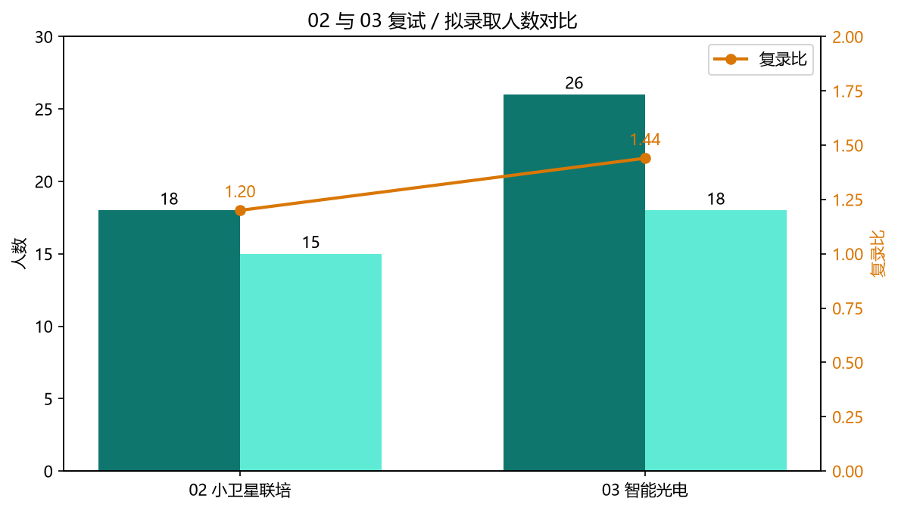
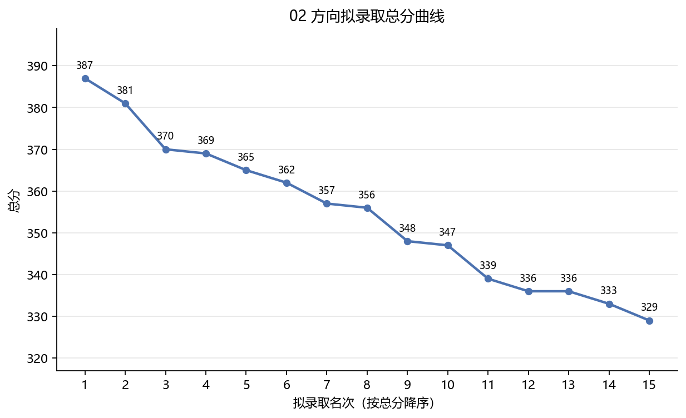
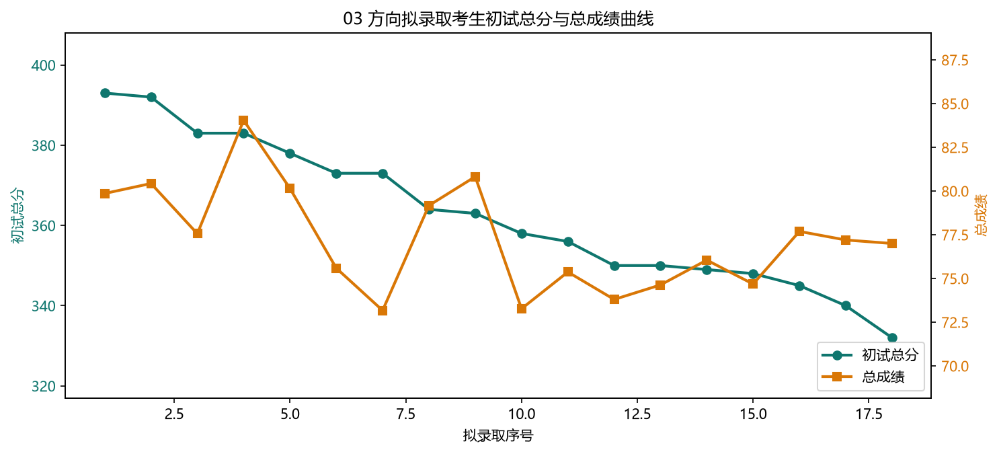
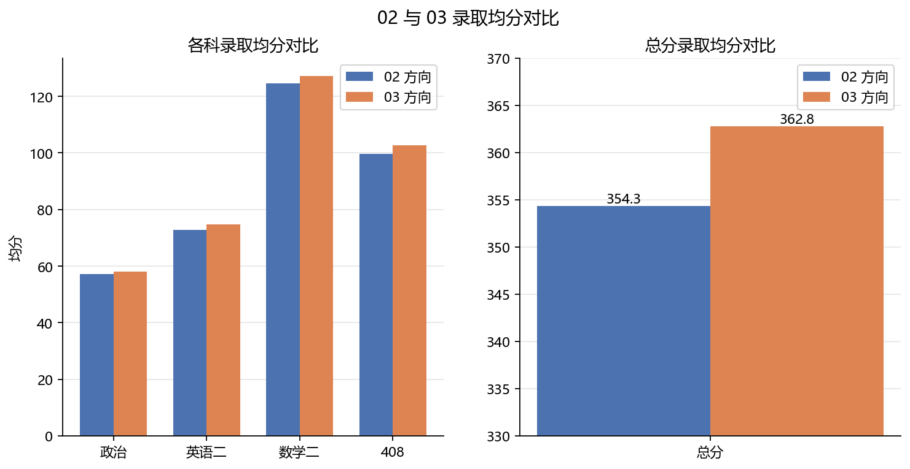

# 26 年复试录取情况

> 数据依据《2026 年国科大杭高院物光学院人工智能（02/03 方向）专业型硕士考生拟录取名单（一志愿）》整理，仅保留拟录取考生，以官方公示为准。

## 数据分析

## （02）小卫星联培方向复试统计

- 复试人数：18
- 拟录取：15
- 复录比：1.20
- 初试均分：56.56 · 73.00 · 123.11 · 97.89 · 350.56
- 录取均分：57.20 · 72.80 · 124.67 · 99.67 · 354.33
- 复试均分：80.84
- 总成绩均分：75.85

| 阶段 | 政治 | 英语二 | 数学二 | 408 | 总分 |
| --- | --- | --- | --- | --- | --- |
| 初试均分（全部复试） | 56.56 | 73.00 | 123.11 | 97.89 | 350.56 |
| 录取均分（拟录取） | 57.20 | 72.80 | 124.67 | 99.67 | 354.33 |

## （02）拟录取名单

| 政治 | 英语二 | 数学二 | 408 | 总分 | 复试成绩 | 总成绩 |
| --- | --- | --- | --- | --- | --- | --- |
| 58 | 76 | 142 | 111 | 387 | 77.64 | 77.52 |
| 61 | 73 | 137 | 110 | 381 | 74.36 | 75.28 |
| 56 | 79 | 136 | 99 | 370 | 79.52 | 76.76 |
| 62 | 67 | 141 | 99 | 369 | 93.8 | 83.8 |
| 57 | 78 | 124 | 106 | 365 | 89.08 | 81.04 |
| 63 | 80 | 117 | 102 | 362 | 88.1 | 80.25 |
| 55 | 70 | 134 | 98 | 357 | 75.4 | 73.4 |
| 59 | 75 | 117 | 105 | 356 | 79.58 | 75.39 |
| 56 | 69 | 118 | 105 | 348 | 74.08 | 71.84 |
| 62 | 77 | 117 | 91 | 347 | 75.74 | 72.57 |
| 55 | 72 | 122 | 90 | 339 | 82.62 | 75.21 |
| 54 | 70 | 129 | 83 | 336 | 74.38 | 70.79 |
| 48 | 70 | 112 | 106 | 336 | 78.82 | 73.01 |
| 57 | 81 | 111 | 84 | 333 | 90.72 | 78.66 |
| 55 | 55 | 113 | 106 | 329 | 78.78 | 72.29 |

## （03）智能光电方向复试统计

- 复试人数：26
- 拟录取：18
- 复录比：1.44
- 初试均分：56.96 · 75.12 · 124.54 · 102.31 · 358.92
- 录取均分：58.11 · 74.83 · 127.11 · 102.72 · 362.78
- 复试均分：81.94
- 总成绩均分：77.25

| 阶段 | 政治 | 英语二 | 数学二 | 408 | 总分 |
| --- | --- | --- | --- | --- | --- |
| 初试均分（全部复试） | 56.96 | 75.12 | 124.54 | 102.31 | 358.92 |
| 录取均分（拟录取） | 58.11 | 74.83 | 127.11 | 102.72 | 362.78 |

## （03）拟录取名单

| 政治 | 英语二 | 数学二 | 408 | 总分 | 复试成绩 | 总成绩 |
| --- | --- | --- | --- | --- | --- | --- |
| 61 | 79 | 138 | 115 | 393 | 81.12 | 79.86 |
| 59 | 66 | 149 | 118 | 392 | 82.46 | 80.43 |
| 64 | 83 | 130 | 106 | 383 | 78.52 | 77.56 |
| 60 | 85 | 131 | 107 | 383 | 91.48 | 84.04 |
| 57 | 78 | 140 | 103 | 378 | 84.7 | 80.15 |
| 56 | 84 | 135 | 98 | 373 | 76.58 | 75.59 |
| 56 | 85 | 134 | 98 | 373 | 71.74 | 73.17 |
| 52 | 73 | 133 | 106 | 364 | 85.54 | 79.17 |
| 58 | 74 | 128 | 103 | 363 | 89.04 | 80.82 |
| 58 | 70 | 130 | 100 | 358 | 74.94 | 73.27 |
| 62 | 73 | 115 | 106 | 356 | 79.54 | 75.37 |
| 69 | 72 | 101 | 108 | 350 | 77.6 | 73.8 |
| 58 | 67 | 115 | 110 | 350 | 79.26 | 74.63 |
| 64 | 86 | 108 | 91 | 349 | 82.3 | 76.05 |
| 53 | 69 | 118 | 108 | 348 | 79.76 | 74.68 |
| 52 | 67 | 129 | 97 | 345 | 86.38 | 77.69 |
| 52 | 73 | 124 | 91 | 340 | 86.4 | 77.2 |
| 55 | 63 | 130 | 84 | 332 | 87.6 | 77 |
