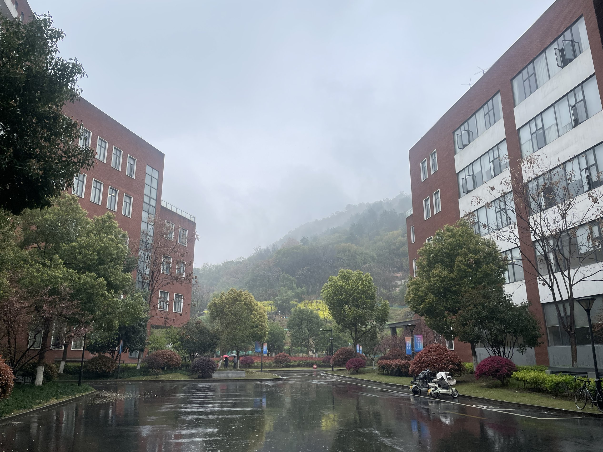

  
忠诚杭高

  <h1 class="guide-hero__title">国科大杭州高等研究院 考研报考指南</h1>
  
真实报录数据 报考全流程 复试潜规则 一手上岸经验，一站讲清

  

    <a class="guide-btn guide-btn--primary" href="#核心指南">阅读报考指南</a>
    <a class="guide-btn guide-btn--ghost" href="#上岸经验分享">上岸经验</a>
  

  
<b>315</b>26年408最低分数线

  
<b>570</b>专硕招生计划

  
<b>A+</b>国科大计算机学科评估

  
<b>4.44万+</b>研一补助最低

  
<b>免学费</b>8000 元学费返还

欢迎来到<b>国科大杭州高等研究院（杭高院）报考与学习指南</b>，一个由考生志愿维护的非官方公益站点，旨在为报考杭高院的同学提供从报考、复试到培养生活的全面参考。

本站内容持续整理中，搜索不到的栏目会留空并标注「待补充」。欢迎各位同学补充修正，投稿请参考 <a href="经验分享投稿模板/">经验分享投稿模板</a>，贡献请查看 <a href="CONTRIBUTORS/">贡献者名单</a>。

## 为什么选择杭高院 {: .guide-visually-hidden }

<section class="guide-section">
  

    <h2>为什么选择杭高院</h2>
    
免学费高补助、复试线梯度清晰、国科大平台与中科院体系共建。

  

  

    

      学费友好
      免学费 + 高补助
      
研一补助约 4.44 万每年，其中 8000 元学费交了会退。

    

    

      复试线
      复试线梯度清晰
      
26 年 智能AI 一志愿线 360 物光315和330、CS 一志愿线 335，不同专业选择明确。

    

    

      A+
      国科大平台
      
国科大计算机学科评估 A+，计算所、软件所、之江实验室等共建。

    

    

      复试公平
      不歧视双非与二战
      
更看重初试与复试表现，经验区有大量双非、跨考、二战上岸案例。

    

    

      志愿友好
      一志愿友好
      
各学院单独划定一志愿复试线，一志愿考生优先录取。

    

    

      学习地点不限
      杭州 + 北京 + 上海
      
研一杭州，后续按导师要求可选择北京、杭州和上海，具体看课题组。

    

  

</section>

### 高起点、小而精的国科大直属二级学院 {: .guide-visually-hidden }

<section class="guide-section">
  

    杭高院概况
    <h2>高起点、小而精的国科大直属二级学院</h2>
    
创办于 2019 年，由杭州市人民政府与国科大共同举办，是集科教创产为一体的新型教学科研机构。

  

  

    

      
<b>国科大杭州高等研究院</b>也是国科大直属二级学院、杭州市直属正局级事业单位、浙江省首批省级新型研发机构。

      
办学定位为「高起点、小而精」，实施「一核两翼」发展战略；学科布局围绕物理光电、生命健康、智能科技、生态环境四大前沿领域，依托多家中国科学院科研院所共建。

    

    <figure class="guide-overview__media">
      
      <figcaption>杭州校区周边环境</figcaption>
    </figure>
  

  

    
<b>2019</b>创办年份

    
<b>8</b>学科交叉型二级学院

    
<b>4</b>前沿领域

    
<b>253</b>高层次人才（含院士）

  

  <h3>二级学院</h3>
  

    基础物理与数学科学学院
    物理与光电工程学院
    化学与材料科学学院
    生命与健康科学学院
    药物科学与技术学院
    环境学院
    分子医学院
    智能科学与技术学院
  

  

    <a class="guide-btn guide-btn--ghost" href="../智能学院/整体介绍/">进入智能学院</a>
    <a class="guide-btn guide-btn--ghost" href="../物理与光电工程学院/整体介绍/">进入物光学院</a>
  

</section>

### 重点实验室与师资 {: .guide-visually-hidden }

<section class="guide-section">
  

    <h2>重点实验室与师资</h2>
    
多个重点实验平台已落户杭高院，师资队伍持续壮大。

  

  

    引力波宇宙太极实验室（杭州）
    中国科学院系统生物学重点实验室
    全省新污染物环境与健康重点实验室
    全省糖科学与糖类药物重点实验室
  

  
通过岗位聘用吸纳包括院士在内的高层次人才 <b>253 名</b>；引进国家级领军人才、四青、优青等全职教学科研人员 <b>182 名</b>。

</section>

## 2026 年报考规模 {: .guide-visually-hidden }

<section class="guide-section">
  

    <h2>2026 年报考规模</h2>
    
招生数据与分数线以教育部、国科大及杭高院官方发布为准。

  

  
2026 年预计招收全日制<b>专业型硕士研究生约 570 人（含推免）</b>，实际招生数以教育部和国科大下达计划为准。

  
学术型硕士除「071009 细胞生物学」「071010 生物化学与分子生物学」「0710J3 生物信息学」「080901 物理电子学」外挂靠各承办单位招生。

  
各学院 2026 年一志愿复试分数线可参考 <a href="../智能学院/复试准备/26年复试录取情况/">复试录取情况</a> 及杭高院官网发布的信息。

</section>

## 报考全流程，一篇讲清 {: .guide-visually-hidden }

<section class="guide-section" id="核心指南">
  

    核心指南
    <h2>报考全流程，一篇讲清</h2>
    
从初试备考到复试上岸的完整攻略，点击进入对应内容。

  

  

    <article class="guide-guide guide-guide--wide">
      初
      初试报考指南
      
初试备考、科目选择与常见问题，一站讲清。

      

        <a class="guide-guide__link" href="../智能学院/初试准备/初试报考指南/">智能院初试</a>
        <a class="guide-guide__link" href="../物理与光电工程学院/初试准备/初试报考指南/">物光院初试</a>
      

    </article>
    <article class="guide-guide">
      复
      复试考核指南
      
复试形式、流程与高分注意事项。

      

        <a class="guide-guide__link" href="../智能学院/复试准备/复试考核指南/">智能院复试</a>
        <a class="guide-guide__link" href="../物理与光电工程学院/复试准备/复试考核指南/">物光院复试</a>
      

    </article>
    <article class="guide-guide">
      数
      复试录取数据
      
AI / CS 复试人数、拟录取与分段录取概率。

      

        <a class="guide-guide__link" href="../智能学院/复试准备/26年复试录取情况/">智能院数据</a>
        <a class="guide-guide__link" href="../物理与光电工程学院/拟录取信息/26年拟录取信息/">物光院数据</a>
      

    </article>
    <article class="guide-guide guide-guide--wide">
      投
      经验投稿模板
      
分享你的备考故事，帮助更多后来者。

      

        <a class="guide-guide__link" href="经验分享投稿模板/">查看模板 →</a>
      

    </article>
  

</section>

## 想考哪个学院，直接点 {: .guide-visually-hidden }

<section class="guide-section">
  

    <h2>想考哪个学院，直接点</h2>
    
学院介绍、报考方向与交流群入口。

  

  

    <a class="guide-college" href="../智能学院/整体介绍/">
      <b>智能学院</b>
      085404 计算机技术 / 085410 人工智能 / 085408 光电信息工程
      <small>进入学院 →</small>
    </a>
    <a class="guide-college" href="../物理与光电工程学院/整体介绍/">
      <b>物理与光电工程学院</b>
      085408 光电信息工程 / 085410 人工智能·小卫星联培与智能光电
      <small>进入学院 →</small>
    </a>
  

  

    <a class="guide-group" href="https://qun.qq.com/universal-share/share?ac=1&svctype=5&tempid=h5_group_info&busi_data=eyJncm91cENvZGUiOiI4MTc0NDUzNTQifQ%3D%3D">
      <b>智能学院（CS/AI）考研交流群</b>
      点击加入 · 817445354
    </a>
    <a class="guide-group" href="https://qun.qq.com/universal-share/share?ac=1&svctype=5&tempid=h5_group_info&busi_data=eyJncm91cENvZGUiOiI2MzM2MjgyMTMifQ%3D%3D">
      <b>物光学院（AI）考研交流群</b>
      点击加入 · 633628213
    </a>
  

</section>

## 在杭高院读研是什么体验 {: .guide-visually-hidden }

<section class="guide-section">
  

    <h2>在杭高院读研是什么体验</h2>
  

  <ul class="guide-list">
    <li>校区、学习地点与宿舍实拍 → <a href="培养与生活/">培养与生活</a></li>
    <li>补助与费用（研一/进组后）→ <a href="补助与费用/">补助与费用</a></li>
  </ul>
</section>

## 官方信息入口 {: .guide-visually-hidden }

<section class="guide-section">
  

    <h2>官方信息入口</h2>
  

  <ul class="guide-list">
    <li>官网：<a href="http://hias.ucas.ac.cn/">hias.ucas.ac.cn</a></li>
    <li>地址：浙江省杭州市西湖区象山支弄 1 号（邮编 310024）</li>
    <li>招生与学位办公室：0571-86086025 · hiaszhaosheng@ucas.ac.cn</li>
    <li>研究生招生信息页：<a href="http://hias.ucas.ac.cn/zsjy2.htm#yjszs">zsjy2.htm#yjszs</a></li>
  </ul>
</section>

## 上岸经验分享 {: .guide-visually-hidden }

  <h2>上岸经验分享</h2>
  
来自不同背景上岸同学的真实备考故事，持续征集中。投稿前请先阅读 <a href="经验分享投稿模板/">经验分享投稿模板</a>。

  

    
把 `.md` 格式的经验贴放进 <b>智能学院/上岸经验分享/</b> 文件夹，重新运行构建脚本后，文章会自动出现在这里和导航中。

  

<section class="guide-pledge">
  <h2 class="guide-visually-hidden">对杭高忠诚</h2>
  <button class="guide-pledge-btn" id="guide-pledge-btn" type="button">对杭高忠诚</button>
  
今日已有 <b class="guide-pledge-count">0</b> 位同学宣誓忠诚杭高院

</section>

  

    
    您是第 0 位宣誓者
  

## 相关站点 {: .guide-visually-hidden }

<section class="guide-section" id="相关站点">
  

    相关站点
    <h2>兄弟院校报考指南</h2>
    
中科院体系内兄弟单位的报考指南站，供择校对比参考。

  

  

    <a class="isc-btn isc-btn--soft" href="https://guide.iscas.win/" target="_blank" rel="noopener">中科院软件所报考指南 →</a>
    <a class="isc-btn isc-btn--soft" href="https://iie.cskaoyan.cn" target="_blank" rel="noopener">中科院信工所报考指南 →</a>
    <a class="isc-btn isc-btn--soft" href="https://sict.cskaoyan.cn" target="_blank" rel="noopener">中科院沈计所报考指南 →</a>
    <a class="isc-btn isc-btn--soft" href="https://ucas-bgi.cskaoyan.cn" target="_blank" rel="noopener">中科院人工智能学院报考指南 →</a>
  

</section>
